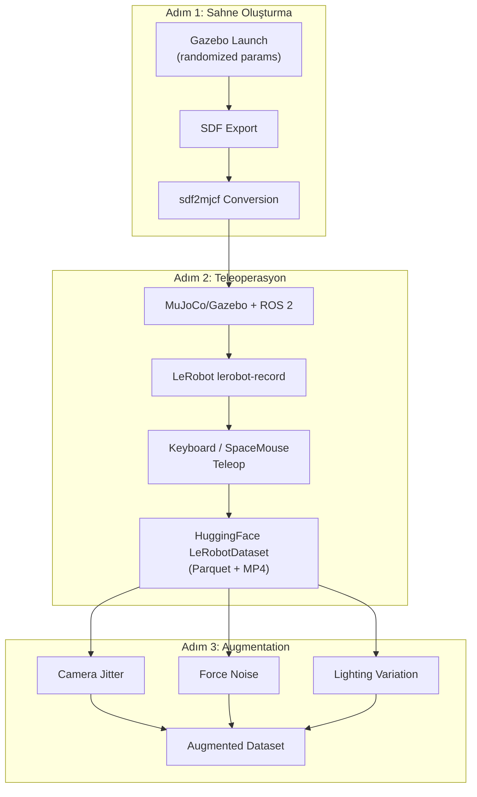
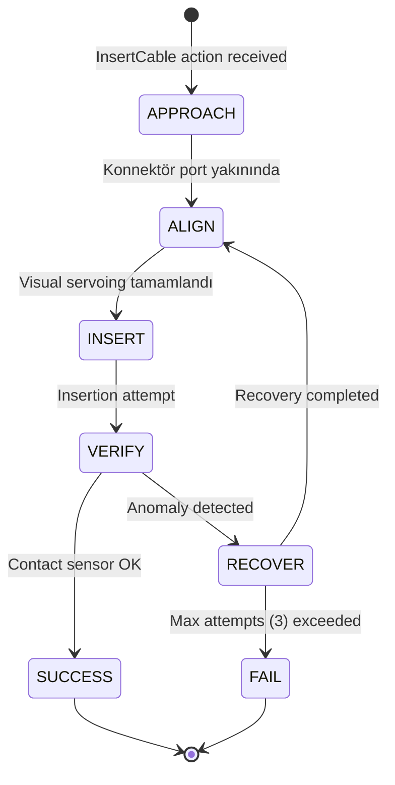
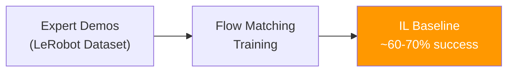
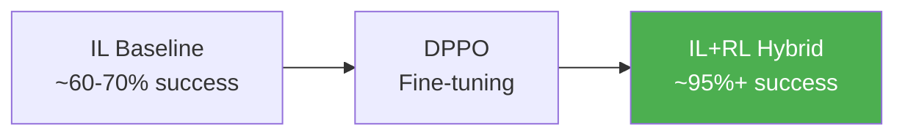
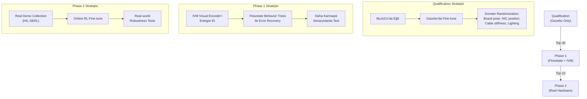

# 🏭 Intrinsic AI for Industry Challenge — Kapsamlı Teknik Blueprint

> Bu doküman, Gemini'nin hazırladığı araştırma raporu ile Claude'un getirdiği eleştirileri sentezleyerek, açıkta kalan tüm teknik soruları cevaplandıran ve pratikte uygulanabilir bir yol haritası sunan bütüncül bir teknik plandır.

---

## 1. Yarışma Bağlamı — Kısa Özet

| Özellik | Detay |
|---------|-------|
| **Görev** | Esnek fiber optik kabloların (SFP, SC) NIC kartları ve SC portlarına otomatik takılması |
| **Robot** | UR5e + Robotiq Hand-E + ATI Axia80 F/T + 3× Basler RGB (20 Hz) |
| **Ödül** | $180,000 (Top 5) |
| **Zaman** | Mart 2026 – Eylül 2026 |
| **Fazlar** | Qualification (Sim) → Phase 1 (Flowstate/IVM) → Phase 2 (Real HW) |
| **Puanlama** | Model Validity (1p) + Performance/Convergence (max 24p, min -36p) + Task Success (max 75p) = **max 100p/trial** |

---

## 2. İki Raporun Sentezi — Nerede Hemfikirler, Nerede Ayrışıyorlar?

### ✅ Her İkisinin de Hemfikir Olduğu Noktalar
- Variable Impedance Control (VIC) **zorunludur**
- Action Chunking **zorunludur** (500Hz kontrolcü vs ~20Hz policy)
- F/T sensör verisi observation uzayına **dahil edilmelidir**
- Diffusion Policy multimodal action distribution için güçlü bir seçenektir
- Domain randomization sim-to-real gap için kritiktir

### ⚠️ Gemini'nin Aldığı ama Claude'un Düzelttiği Pozisyonlar

| Konu | Gemini Pozisyonu | Claude Eleştirisi | **Bizim Kararımız** |
|------|-----------------|-------------------|---------------------|
| **RL Kullanımı** | Online/Offline RL tamamen reddedildi | HIL-SERL, DPPO, RL-100 kanıtları çok güçlü; IL+RL hibrit en iyi sonuçları veriyor | **IL → DPPO fine-tune (Hybrid IL+RL)** |
| **Diffusion vs Flow Matching** | Diffusion (DDPM/DDIM) önerildi | Flow matching 19× daha hızlı, π0 bunu kullanıyor | **Flow Matching birincil, Diffusion + Consistency Distillation fallback** |
| **Görev Yapısı** | Monolitik tek politika | Hierarchical decomposition 2× performans artışı | **FSM + subtask-specific politikalar** |
| **Framework** | LeRobot doğrudan kullanılsın | LeRobot ROS 2 / Gazebo / F/T entegrasyonu yok | **Custom PyTorch + ROS 2; LeRobot referans kod olarak** |
| **Perception** | RGB-only yeterli | Depth olmadan kablo 3D durumu belirsiz | **RGB + stereo depth (3 kamera) + learned monocular depth fallback** |
| **Failure Recovery** | Ele alınmadı | F/T anomaly detection + recovery primitives zorunlu | **GPR/threshold tabanlı anomaly + spiral search recovery** |

### 🔴 Her İkisinin de Netleştirmediği Açık Sorular — Burada Çözüyoruz

---

## 3. AÇIK SORU #1: Eğitimi Nerede Yapacağız? (MuJoCo vs Gazebo vs Isaac Sim)

### Kesin Karar: **Dual-Track — MuJoCo'da eğit, Gazebo'da eval & fine-tune**

```mermaid
graph LR
    A["Gazebo Simülasyonu"] -->|SDF Export| B["/tmp/aic.sdf"]
    B -->|sdf2mjcf| C["MuJoCo MJCF"]
    C -->|Hızlı Eğitim<br/>+ Domain Rand.| D["Eğitilmiş Policy"]
    D -->|Gazebo'ya Deploy| E["Gazebo Eval"]
    E -->|Fine-tune| F["Final Policy"]
    F -->|Docker Submit| G["Qualification"]

    style C fill:#4CAF50,color:white
    style E fill:#2196F3,color:white
```



#### Neden MuJoCo Birincil Eğitim Ortamı?

| Kriter | MuJoCo | Gazebo | Isaac Sim |
|--------|--------|--------|-----------|
| **Hız** | ⚡ Çok hızlı (headless batch) | 🐌 Yavaş (real-time sim) | ⚡ GPU-accelerated ama setup karmaşık |
| **Kablo Fiziği** | ✅ `elasticity.cable` plugin (DER) | ❌ Rigid-link chain (zayıf) | ✅ Deformable body ama karmaşık |
| **AIC Entegrasyonu** | ✅ Resmi destek var: `aic_mujoco` paketi | ✅ Eval ortamı (resmi) | ✅ Resmi destek var: `aic_isaac` paketi |
| **ros2_control** | ✅ `mujoco_ros2_control` ile aynı interface | ✅ Native | ⚠️ Mümkün ama ekstra setup |
| **Domain Randomization** | ✅ XML modifikasyonu kolay | ⚠️ SDF parametreleri ile sınırlı | ✅ Programmatic, güçlü |
| **ARM-64 macOS** | ⚠️ CPU-only, yavaş olabilir | ⚠️ Docker gerekli | ❌ NVIDIA GPU zorunlu |

> [!IMPORTANT]
> **AIC toolkit zaten Gazebo → MuJoCo dönüşüm pipeline'ı sağlıyor.** `sdf2mjcf` + `add_cable_plugin.py` ile sahne otomatik dönüştürülüyor. Aynı `aic_controller` interface'i her iki simülatörde de çalışıyor.

#### Pratik Workflow:

1. **Gazebo'da sahne tasarla** → Domain randomization parametrelerini ayarla
2. **Sahneyi export et** → `/tmp/aic.sdf` → `sdf2mjcf` → MJCF
3. **MuJoCo'da yoğun eğitim** → Headless, hızlı iteration
4. **Gazebo'da validation** → Eval ortamında test et, gap varsa fine-tune
5. **Submission** → Gazebo eval container'da çalışan Docker image

> [!WARNING]
> **Eğitim için yerel macOS ARM-64 yeterli değil.** Cloud GPU (RTX 4090 / A100) gerekecek. Alternatif: Google Cloud, Lambda Labs, VAST.ai. Eğitim süresi: subtask başına ~4-8 saat (tek GPU). Toplam: ~2-3 gün (paralel).

---

## 4. AÇIK SORU #2: Veri Üretimini Nasıl Yapacağız?

### Kesin Karar: **Simülasyonda Teleoperasyon + Otomatik Augmentation**

Yarışmada robot kabloyı **zaten elde tutarak başlıyor** ve insertion yapması gerekiyor. Bu durum veri toplama işini sadeleştirir: tam bir cable routing pipeline'ı değil, **yaklaşma + hizalama + sokulma** için veri toplamamız yeterli.

#### Veri Toplama Pipeline'ı



#### Detaylı Veri Toplama Spesifikasyonları

| Parametre | Değer | Açıklama |
|-----------|-------|----------|
| **Subtask sayısı** | 3 (yaklaşma, hizalama, insertion) | Hierarchical decomposition'a uygun |
| **Demo sayısı / subtask** | 100-200 | Proficient-quality; quality > quantity |
| **Observation kaydedilen** | 3× RGB (raw), F/T 6-axis, joint states, TCP pose/velocity, controller state |
| **Action kaydedilen** | Cartesian pose (6D) + gripper + stiffness/damping parametreleri |
| **Toplam veri toplama süresi** | ~5-7 gün (deneyimli teleoperatör ile) |
| **Teleop araçları** | SpaceMouse (tercih) veya Keyboard, LeRobot `aic_keyboard_ee` / `aic_spacemouse` |
| **Kaydetme formatı** | LeRobotDataset (Parquet + senkronize MP4) |
| **Kaydetme komutu** | `pixi run lerobot-record --robot.type=aic_controller ...` |

> [!TIP]
> **CheatCode policy'yi kullanarak semi-otomatik veri üretimi de mümkün.** Ground truth pozisyonlarını kullanarak başlangıç yörüngeleri oluşturup, insan teleoperatörün sadece insertion kısmını override etmesi sağlanabilir. Bu, veri toplama süresini ~%50 azaltır.

#### Veri Kalitesi Kontrol Listesi

- [ ] Her episode başında F/T sensörü tare edildi mi? (`ros2 service call /aic_controller/tare_force_torque_sensor`)
- [ ] Başarılı insertion contact sensor tarafından doğrulandı mı?
- [ ] Max kuvvet < 20N limiti aşılmadı mı? (aksi halde episode discard)
- [ ] Episode süresi makul mü? (> 60s olanları filtrele)
- [ ] Gripper kayma (slippage) yaşanmadı mı?

---

## 5. AÇIK SORU #3: Hangi Model Mimarisi? — Nihai Sistem Tasarımı

### Hierarchical Architecture: FSM + Subtask-Specific Policies

Monolitik single policy yerine, görevin doğal ayrışmasını takip eden hierarchical yapı:



#### Her Subtask'ın Detaylı Spesifikasyonu

##### Subtask 1: APPROACH (Yaklaşma)
| Özellik | Detay |
|---------|-------|
| **Hedef** | TCP'yi hedef portun ~5mm yakınına getir |
| **Kontrol Modu** | Position control, yüksek stiffness (K = 85) |
| **Observation önceliği** | RGB kameralar (port lokalizasyonu), gripper TCP pose |
| **Policy türü** | Flow matching veya basit waypoint interpolation |
| **Hız** | Hızlı — "Efficiency" puanı burada kazanılır |
| **Bitirme koşulu** | TCP-port mesafesi < 5mm VE port kamera görüşünde |

##### Subtask 2: ALIGN (Hizalama)
| Özellik | Detay |
|---------|-------|
| **Hedef** | Konnektörü port eksenine milimetrik olarak hizala |
| **Kontrol Modu** | Position + moderate compliance (K = 40-60) |
| **Observation önceliği** | Wrist kameraları (close-up), F/T initial contact |
| **Policy türü** | Flow matching / Diffusion policy (multimodal) |
| **Hız** | Orta — dikkatli ama çok yavaş değil |
| **Bitirme koşulu** | Konnektör ekseni ≈ port ekseni (< 1mm lateral, < 2° açısal) |

##### Subtask 3: INSERT (Sokulma)
| Özellik | Detay |
|---------|-------|
| **Hedef** | Konnektörü port içine tam yerleştir |
| **Kontrol Modu** | Variable Impedance — düşük stiffness (K = 15-30) |
| **Observation önceliği** | **F/T sensörü birincil**, RGB ikincil |
| **Policy türü** | Flow matching + F/T conditioning |
| **Hız** | Yavaş ve kontrollü — "Safety" puanı burada kazanılır |
| **Bitirme koşulu** | Contact sensor activation VEYA F/T profil "seated" pattern |

##### Subtask 4: VERIFY + RECOVER (Doğrulama + Kurtarma)
| Özellik | Detay |
|---------|-------|
| **Doğrulama** | Contact sensor + F/T profil analizi |
| **Anomaly tespiti** | F/T > 15N threshold, profil gaussian process'ten sapma |
| **Recovery primitive** | 5-10mm geri çek → ±2mm lateral shift (spiral search) → re-attempt |
| **Max deneme** | 3 deneme, sonra FAIL |

---

## 6. Policy Mimarisinin Teknik Detayları

### 6.1 Action Generation: Flow Matching (Birincil)

```
Observation (RGB + F/T + Proprio) → Encoder → Conditioning → Flow ODE → Action Chunk [Tp steps]
```

| Parametre | Değer | Gerekçe |
|-----------|-------|---------|
| **Model** | Conditional Flow Matching (CFM) | 1-step inference ~8ms, 19× diffusion'dan hızlı |
| **Prediction horizon (Tp)** | 16 steps | ~800ms'lik yörünge (20Hz'de) |
| **Execution horizon (Te)** | 8 steps | Re-plan her 400ms'de (2.5Hz inference yeterli) |
| **Observation horizon (To)** | 2 steps | Son 2 observation (100ms) |
| **Action space boyutu** | 6 (pose) + 1 (gripper) + 6 (stiffness diagonal) + 6 (damping diagonal) = **19D** |
| **Visual encoder** | ResNet-18 (pretrained, frozen early layers) | Hafif, 4090'da rahat inference |
| **F/T encoder** | 1D-CNN (temporal window = 10 steps = 500ms) | Kuvvet trendlerini yakala |
| **Fusion** | Cross-Attention (visual features + F/T features) | FARM paper'ından valide edilmiş |

> [!NOTE]
> **Fallback: Diffusion + Consistency Distillation.** Eğer flow matching implementasyonunda sorun yaşanırsa, standart DDPM teacher → Consistency student pipeline kullanılır. Consistency Policy ~21ms inference sağlar.

### 6.2 Action Space — Genişletilmiş VIC Eylem Vektörü

```python
action = {
    # Cartesian Pose Target (base_link frame)
    'target_position': [x, y, z],           # meters
    'target_orientation': [qx, qy, qz, qw], # quaternion
    
    # Gripper
    'gripper_position': float,  # 0.0 (kapalı) - 1.0 (açık)
    
    # Variable Impedance (diagonal elements)
    'target_stiffness': [Kx, Ky, Kz, Krx, Kry, Krz],  # N/m, Nm/rad
    'target_damping':   [Dx, Dy, Dz, Drx, Dry, Drz],   # Ns/m, Nms/rad
}
```

Bu doğrudan `MotionUpdate` ROS mesajına map edilir:
- `pose` → `target_position` + `target_orientation`
- `target_stiffness` → 6×6 diagonal matris
- `target_damping` → 6×6 diagonal matris

### 6.3 Observation Space

```python
observation = {
    # Visual (3 kamera)
    'left_image':   np.array([1024, 1152, 3]),   # RGB uint8
    'center_image': np.array([1024, 1152, 3]),
    'right_image':  np.array([1024, 1152, 3]),
    
    # Force-Torque (temporal window)
    'wrench_history': np.array([10, 6]),  # Son 10 step, [Fx,Fy,Fz,Tx,Ty,Tz]
    
    # Proprioception
    'joint_positions': np.array([6]),     # UR5e 6-DOF
    'joint_velocities': np.array([6]),
    'tcp_pose': np.array([7]),            # position(3) + quaternion(4)
    'tcp_velocity': np.array([6]),        # linear(3) + angular(3)
    'gripper_state': float,
    
    # Task specification
    'target_port_type': str,              # 'SFP_PORT' veya 'SC_PORT'
    'target_port_id': int,                # 0 veya 1
}
```

---

## 7. Eğitim Paradigması: IL → RL Fine-Tuning

### Phase 1: Imitation Learning (Behavioral Cloning)



| Parametre | Değer |
|-----------|-------|
| **Framework** | Custom PyTorch (LeRobot policy code referans) |
| **Optimizer** | AdamW, lr=1e-4, cosine annealing |
| **Batch size** | 64 |
| **Epochs** | 500 (early stopping on val loss) |
| **GPU** | 1× RTX 4090 |
| **Süre** | ~4-8 saat / subtask |
| **Loss** | Flow matching loss (MSE on velocity field) |

### Phase 2: RL Fine-Tuning (DPPO)



| Parametre | Değer |
|-----------|-------|
| **Algoritma** | DPPO (Diffusion Policy Policy Optimization) |
| **Reward** | Sparse: +1 insertion success, -0.1 F/T violation, -0.01 per step |
| **Clipping** | ε = 0.2 (standart PPO) |
| **Rollout ortamı** | MuJoCo (headless, paralel) |
| **Rollout sayısı** | 1000 episodes / iteration |
| **Iteration** | ~50-100 iteration |
| **Süre** | ~8-16 saat (tek GPU) |

> [!IMPORTANT]
> **Neden IL tek başına yetmez?** 
> - Demo verisinde nadir olan "kurtarma hareketlerini" öğrenemez
> - Konnektör açısının hafifçe farklı olduğu edge case'lerde başarısız olur  
> - DPPO, pre-trained diffusion/flow policy üzerinde çalışarak bu gap'i kapatır
> - HIL-SERL kanıtı: insertion task'larda %100 başarı oranı

---

## 8. Framework ve Kod Mimarisi

### Neden LeRobot Doğrudan Kullanılmıyor?

| Sorun | Detay |
|-------|-------|
| ROS 2 Native Değil | LeRobot gym-style env bekler; AIC ise ROS 2 lifecycle node |
| F/T Entegrasyonu Yok | Standart observation pipeline'ında wrench yok |
| Gazebo Entegrasyonu Yok | Simülasyon desteği LIBERO, Meta-World yönelimli |
| VIC Action Space Yok | Stiffness/damping parametreleri standart dışı |

### Ancak LeRobot Kullanılacak Yerler

1. **Veri toplama**: `lerobot-record` komutu (tam entegre, `aic_controller` desteği var)
2. **Veri formatı**: LeRobotDataset (Parquet + MP4)
3. **Referans policy kodu**: ACT ve Diffusion Policy implementasyonları
4. **Eğitim**: `lerobot-train` kullanılabilir (custom policy type ile)

### Önerilen Kod Yapısı

```
aic/
├── my_policy/                    # Ana policy paketi (ROS 2 package)
│   ├── my_policy/
│   │   ├── __init__.py
│   │   ├── policy.py             # aic_model.Policy subclass — FSM dispatcher
│   │   ├── fsm.py                # Finite State Machine (APPROACH→ALIGN→INSERT→VERIFY)
│   │   ├── subtask_approach.py   # Approach subtask policy
│   │   ├── subtask_align.py      # Alignment subtask policy  
│   │   ├── subtask_insert.py     # Insertion subtask policy
│   │   ├── recovery.py           # Failure detection + recovery primitives
│   │   ├── models/
│   │   │   ├── flow_policy.py    # Flow matching / Diffusion policy network
│   │   │   ├── visual_encoder.py # ResNet-18 + multi-view fusion
│   │   │   ├── ft_encoder.py     # 1D-CNN for F/T temporal encoding
│   │   │   └── vic_head.py       # Variable impedance output head
│   │   ├── utils/
│   │   │   ├── observation.py    # ROS msg → tensor conversion
│   │   │   ├── action.py         # Tensor → MotionUpdate conversion
│   │   │   └── transforms.py    # Data augmentation
│   │   └── config/
│   │       ├── approach.yaml
│   │       ├── align.yaml
│   │       └── insert.yaml
│   ├── weights/                  # Trained model checkpoints
│   ├── package.xml
│   ├── pixi.toml
│   └── setup.py
├── training/                     # Eğitim scriptleri (ROS 2 package değil)
│   ├── train_il.py               # Imitation Learning training loop
│   ├── train_dppo.py             # DPPO fine-tuning loop
│   ├── collect_data.py           # Automated data collection wrapper
│   ├── evaluate.py               # MuJoCo headless evaluation
│   └── configs/
│       ├── il_config.yaml
│       └── rl_config.yaml
└── docs/
    └── ...
```

---

## 9. Puanlama Optimizasyon Stratejisi

Scoring breakdown'a göre optimize edilmiş strateji:

| Metrik | Max Puan | Strateji | Riskler |
|--------|----------|----------|---------|
| **Task Success** | 75 | Hierarchical + RL fine-tune ile >%95 başarı | Wrong port = -12 → Task msg'den port ID'yi kesinlikle oku |
| **Task Duration** | 12 | APPROACH'ta hızlı (≤5s ideal, <60s zorunlu) | Çok hızlı = Safety riski |
| **Trajectory Smoothness** | 6 | Action chunking + interpolation (düşük jerk) | Dt'den gelen gürültü |
| **Trajectory Efficiency** | 6 | Direkt yol, gereksiz hareket yok | Recovery loop'lar path uzatır |
| **Insertion Force** | 0 (ceza yok) | VIC ile F < 20N garanti | 1 saniye kuralı var, kısa spike'lar OK |
| **Off-Limit Contact** | 0 (ceza yok) | Collision-aware trajectory + clamped workspace | -24 puan! En büyük risk |

> [!CAUTION]
> **Off-Limit Contact cezası (-24) çok ağır.** Task board'a veya enclosure'a çarpma tek bir trial'ı sıfırlayabilir. Workspace clamping limitleri `aic_controller` tarafından uygulanıyor ama policy'nin de collision-aware olması şart.

### Hedef Puan Profili (per trial)

| Bileşen | Hedef |
|---------|-------|
| Model Validity | 1/1 |
| Smoothness | 5/6 |
| Duration | 8/12 (15-20 saniye hedefi) |
| Efficiency | 4/6 |
| Force Penalty | 0 |
| Contact Penalty | 0 |
| Task Success | 75/75 |
| **TOPLAM** | **~93/100** |

---

## 10. Sim-to-Real ve Faz Geçiş Stratejisi

### Qualification → Phase 1 Geçişi



### Domain Randomization Parametreleri

| Parametre | Aralık | Gerekçe |
|-----------|--------|---------|
| Task board position (x,y) | ±5cm | Eval'de randomize |
| Task board yaw | ±15° | Eval'de randomize |
| NIC card rail (0-4) | Uniform | Eval'de randomize |
| NIC card translation | [-0.0215, 0.0234]m | Eval'de randomize |
| NIC card yaw offset | [-10°, +10°] | Eval'de randomize |
| SC port translation | [-0.06, 0.055]m | Eval'de randomize |
| Cable stiffness | ±30% | Sim-to-real robustness |
| Cable damping | ±30% | Sim-to-real robustness |
| Lighting intensity | ±20% | Sim-to-real robustness |
| Camera noise | Gaussian σ=0.01 | Sim-to-real robustness |
| Grasp pose offset | ~2mm, ~0.04 rad | Yarışma spec'inde belirtilmiş |

---

## 11. Zamanlama ve Milestone'lar

```
Mart 2 ─────────── Qualification Start
  │
  ├── Hafta 1-2 (Mart 2-16): Ortam kurulumu, toolkit çalıştırma, MuJoCo dönüşüm
  ├── Hafta 3-4 (Mart 17-30): CheatCode ile baseline, teleop ile veri toplama başla
  ├── Hafta 5-6 (Nisan 1-13): IL training (Flow Matching / Diffusion), baseline sonuçlar
  ├── Hafta 7-8 (Nisan 14-27): DPPO fine-tuning, hierarchical FSM, recovery
  ├── Hafta 9-10 (Nisan 28 - Mayıs 11): Domain rand. ile robustness, Gazebo eval
  └── Mayıs 12-15: Final submission hazırlığı
  
Mayıs 15 ────────── Qualification Deadline
Mayıs 18-27 ─────── Evaluation Period
Mayıs 28 ─────────── Top 30 Announced → Phase 1 Start
```

### Şu Anki Durum (3 Nisan 2026)

> [!WARNING]
> **Deadline'a 42 gün kaldı.** Hafta 5'teyiz — IL training'e başlanmalı. Veri toplama bu hafta başlamalı.

---

## 12. Hesaplama Kaynakları

| Kaynak | Gereksinim | Alternatifler |
|--------|-----------|---------------|
| **Eğitim GPU** | 1× RTX 4090 (24GB) veya A100 | Google Cloud, Lambda Labs, VAST.ai |
| **Eğitim Süresi** | ~40-60 GPU-saat (toplam tüm subtask'lar) | ~$50-100 cloud maliyeti |
| **Simülasyon** | Linux x86-64, Docker (Gazebo eval container) | Yerel macOS ARM-64 Docker ile mümkün ama yavaş |
| **Disk** | ~50GB (dataset + model weights + sim assets) | - |
| **RAM** | 32GB+ (simülasyon + eğitim) | - |

---

## 13. Risk Matrisi ve Azaltma Planları

| Risk | Olasılık | Etki | Azaltma |
|------|----------|------|---------|
| MuJoCo kablo fiziği Gazebo'dan çok farklı | Orta | Yüksek | Dual-sim domain randomization; Gazebo fine-tune |
| Veri toplama yavaş | Orta | Yüksek | Semi-otomatik (CheatCode + override) |
| Flow Matching implementasyonu zor | Düşük | Orta | Diffusion + Consistency Distillation fallback |
| Off-limit contact cezası | Orta | Çok Yüksek | Workspace clamping + policy-level collision avoidance |
| Cloud GPU erişim sorunu | Düşük | Yüksek | Birden fazla provider, spot instance |
| RL fine-tuning instabilite | Orta | Orta | Conservative clipping, IL checkpoint'a rollback |
| Kablo simülasyonunda oscillation | Yüksek | Orta | Joint damping artırma, inertia düşürme (aic_mujoco zaten yapıyor) |

---

## 14. Hemen Başlanacak Aksiyonlar (Action Items)

1. **[URGENT]** Cloud GPU provider seç ve hesap aç 
2. **[URGENT]** Gazebo eval container'ı çalıştır ve CheatCode policy'yi test et
3. **[URGENT]** MuJoCo entegrasyonunu kur (sdf2mjcf pipeline)
4. **[Bu hafta]** LeRobot teleop ile ilk 20-30 demo kaydet (SFP insertion)
5. **[Bu hafta]** `my_policy` ROS 2 paketi iskeletini oluştur
6. **[Gelecek hafta]** IL training başlat (en basit single-policy ile)
7. **[2 hafta sonra]** Hierarchical FSM + subtask policies
8. **[3 hafta sonra]** DPPO fine-tuning
9. **[4 hafta sonra]** Domain randomization + robustness testing
10. **[5 hafta sonra]** Submission hazırlığı + Docker image test

---

## Open Questions — Senin Kararın Gereken Noktalar

> [!IMPORTANT]
> Aşağıdaki sorularda senin tercihini bekliyorum:

1. **Cloud GPU tercihin var mı?** (Google Cloud, Lambda Labs, VAST.ai, başka?)
2. **Teleop cihazı**: SpaceMouse'un var mı yoksa keyboard ile mi yapacağız?
3. **Flow Matching mı Diffusion mı ile başlayalım?** (Flow Matching daha hızlı inference ama daha az mevcut kod; Diffusion daha mature, LeRobot'ta referans implementasyonu var)
4. **Tek başına mı çalışıyorsun yoksa takım mı?** (Veri toplama stratejisi buna göre değişir)
5. **macOS'ta Docker/Gazebo çalıştırabiliyor musun?** (ARM-64 üzerinde Gazebo'nun durumu net değil, Linux VM gerekebilir)
